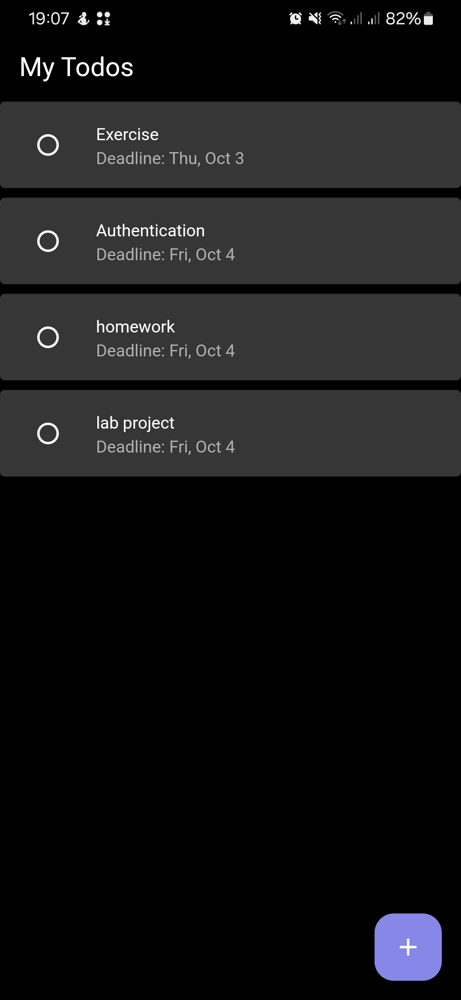
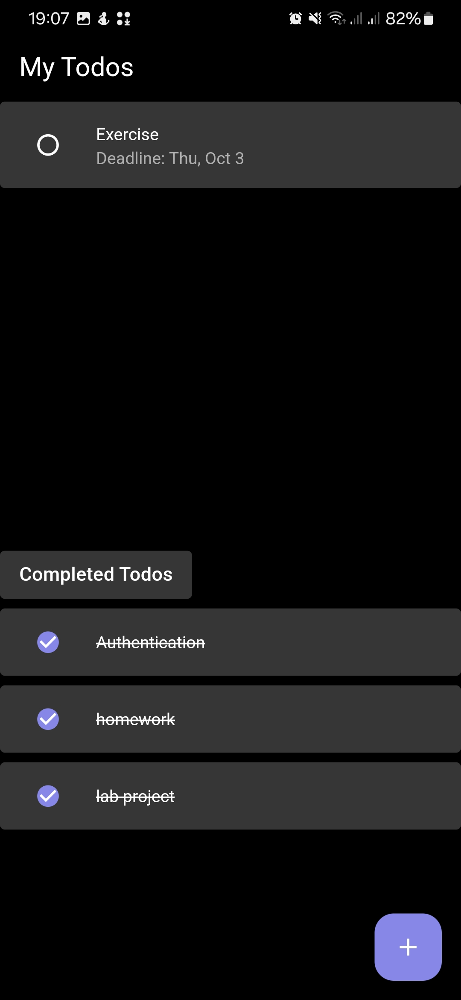
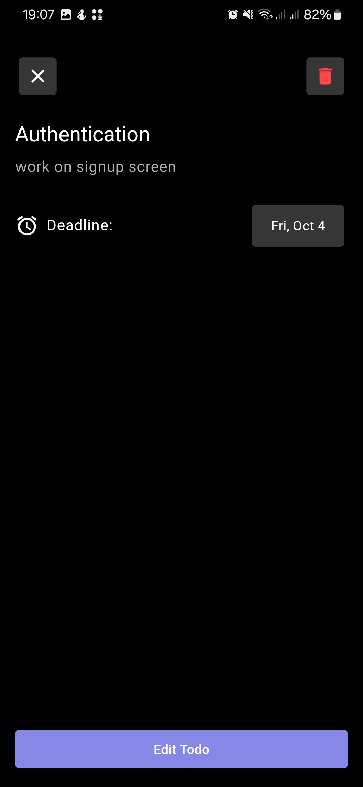
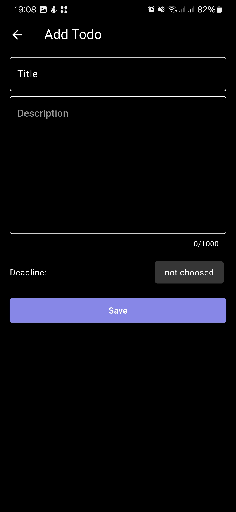
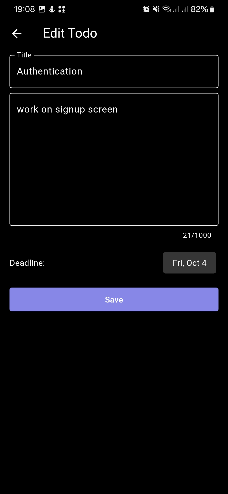

# Todo App

A simple yet powerful Todo app developed using `isar` as the backend and `flutter_bloc` for state management. This app allows users to create, update, and manage their todos efficiently with a clean and intuitive UI.

## Features
- **Add and Edit Todos**: Easily manage your tasks.
- **Todo Details**: View detailed information about each todo.
- **State Management**: Leveraging `flutter_bloc` for clean and maintainable state management.
- **Local Storage**: Using `isar` as a high-performance NoSQL database.

## Screenshots

### 1. My Todos Screen
<div>
  
  
</div>

### 2. Todo Details Screen
<div>
  
</div>

### 3. Add & Edit Todo Screen
<div>
  
  
</div>

## Project Structure

- **assets/**
  - Contains all images used in the project.

- **src/**
  - Main project directory containing all core features and logic.

  - **src/features/**
    - Feature-based folder structure for better scalability.

    - **src/features/data/**
      - Contains the Isar database configuration.

    - **src/features/domain/**
      - Contains the Todo model and the database repository structure.

    - **src/features/presentation/**
      - Holds all UI elements and widgets.

      - **src/features/presentation/cubit/**
        - Contains BLoC cubits for state management.

## Requirements
1. Flutter SDK
2. Android Studio or Visual Studio Code

## Installation

To get started with this project:

1. Clone the repository:
   ```bash
   git clone https://github.com/Bilawal-Mehfooz-Malik/todo_app
   ```
2. Navigate to the project directory:
   ```bash
   cd todo_app
   ```

3. Install Dependencies:
    ```bash
    flutter pub get
    ```
3. Run the project:
   ```bash
   flutter run
   ```